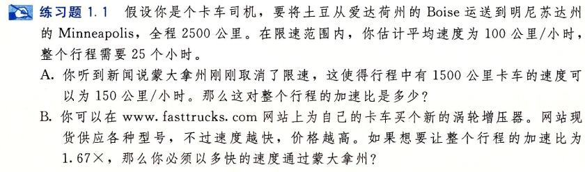
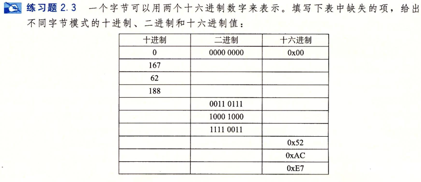

### exe 1.1 

- A. 1.25x

- B. 300公里/小时

### exe 1.2

k = 2.67

### exe 2.1

- A. 1110011010011111111000

- B. 0xC97B

- C. 11010101111001001100

- D. 26E7B5

### exe 2.2

### exe 2.3

### exe 2.4

### exe 2.5

- A. 小端法: 21       大端法: 87

- B. 小端法: 21 43    大端法: 87 65

- C. 小端法: 21 43 65 大端法: 87 65 43

- A. 整数: 00000000001101011001000101000001 浮点数: 1001010010101100100010100000100
