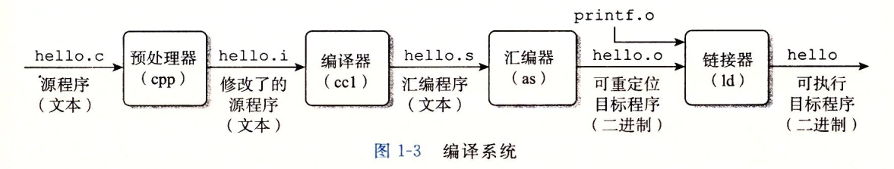

## 第一章 计算机系统漫游

计算机系统由**硬件**和**系统软件**组成的.

如果能够完全理解底层计算机系统以及它对应用程序的影响, 那么就会步上成为为数不多的"大牛"的道路.

### 1.1 信息就是位+上下文

只由ASCII字符构成的文件称为**文本文件**, 所有其他文件都称为**二进制文件**.

系统中所有的信息——包括磁盘文件、内存中的程序、内存中存放的用户数据以及网络上传送的数据, 都是由一串比特表示的. 区分不同数据对象的唯一方法是我们读到这些数据对象时的上下问.

### 1.2 程序被其他程序翻译成不同的格式

从`hello.c`文件编译到`hello`二进制可执行文件, 总共分为4个阶段完成:

- 预处理器
- 编译器
- 汇编器
- 链接器

### 1.3 了解编译系统如何工作是大有益处的

- 优化程序性能

- 理解链接时出现的错误

- 避免安全漏洞

### 1.4 处理器读并解释存储在内存中的指令

#### 1.4.1 系统的硬件组成

#### 1.4.2 运行hello程序

### 1.5 高速缓存至关重要

意识到高速缓存存储器存在的应用程序员能够利用高速缓存将程序的性能提高一个数量级.
