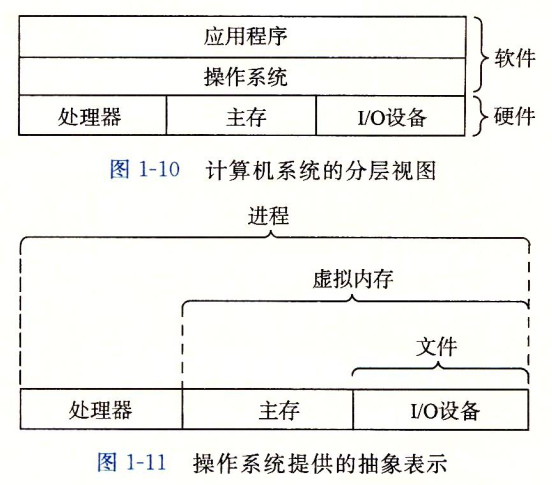

## 第一章 计算机系统漫游

计算机系统由**硬件**和**系统软件**组成的.

如果能够完全理解底层计算机系统以及它对应用程序的影响, 那么就会步上成为为数不多的"大牛"的道路.

### 1.1 信息就是位+上下文

只由ASCII字符构成的文件称为**文本文件**, 所有其他文件都称为**二进制文件**.

系统中所有的信息——包括磁盘文件、内存中的程序、内存中存放的用户数据以及网络上传送的数据, 都是由一串比特表示的. 区分不同数据对象的唯一方法是我们读到这些数据对象时的上下问.

### 1.2 程序被其他程序翻译成不同的格式

从`hello.c`文件编译到`hello`二进制可执行文件, 总共分为4个阶段完成:

- 预处理器
- 编译器
- 汇编器
- 链接器

### 1.3 了解编译系统如何工作是大有益处的

- 优化程序性能

- 理解链接时出现的错误

- 避免安全漏洞

### 1.4 处理器读并解释存储在内存中的指令

#### 1.4.1 系统的硬件组成

#### 1.4.2 运行hello程序

### 1.5 高速缓存至关重要

意识到高速缓存存储器存在的应用程序员能够利用高速缓存将程序的性能提高一个数量级.

### 1.6 存储设备形成层次结构

存储器层次结构的主要思想是上一层的存储器作为低一层存储器的高速缓存.

### 1.7 操作系统管理硬件

操作系统有两个基本功能:

- 防止硬件被失控的应用程序滥用;

- 向应用程序提供简单一致的机制来控制复杂而又通常大不相同的低级硬件设备.

操作系统通过几个基本的抽象概念(进程、虚拟内存和文件)来实现这两个功能. 文件是对I/O设备的抽象表示, 虚拟内存是对主存和磁盘I/O设备表示, 进程则是对处理器、主存和I/O设备的抽象表示. 

#### 1.7.1 进程

**进程**是操作系统对一个正在运行的程序的一种抽象. 在一个系统上可以同时运行多个进程, 而每个进程都好像在独占地使用硬件. 而**并发运行**, 则是说一个进程的指令和另一个进程的指令是交错执行的. 操作系统实现这种交错执行的机制称为**上下文切换**.

操作系统保存跟踪进程运行所需的所有状态信息. 这种状态, 也就是**上下文**, 包括许多信息, 比如**PC和寄存器文件的当前值, 以及主存的内容**. 在任何一个时刻, 单处理器系统都只能执行一个进程的代码. 当操作系统决定要把控制权从当前进程转移到某个新进程时, 就会进行**上下文切换**, 即保存当前进程的上下文、恢复新进程的上下文, 然后将控制权传递到新进程.

如下图所示, 从一个进程到另一个进程的转换是由操作系统**内核**(kernel)管理的. 内核是操作系统代码常驻主存的部分. 当应用程序需要操作系统的某些操作时, 比如读写文件, 它就执行一条特殊的**系统调用**(system call)指令, 将控制权传递给内核. 然后内核执行被请求的操作并返回应用程序. 注意, 内核不是一个独立的进程. 相反, 它是系统管理全部进程所用代码和数据结构的集合.

#### 1.7.2 线程

尽管通常我们认为一个进程只有单一的控制流, 但是在现代系统中, 一个进程实际上可以由多个称为**线程**的执行单元组成, **每个线程都运行在进程的上下文中, 并共享同样的代码和全局数据.** 由于网络服务器中对并行处理的需求, 线程成为越来越重要的编程模型, 因为多线程之间比多进程之间更容易共享数据, 也因为线程一般来说都比进程更高效. 当有多处理器可用的时候, 多线程也是一种使得程序可以运行得更快的方法.

#### 1.7.3 虚拟内存

**虚拟内存**是一个抽象概念, 它为每个进程提供了一个假象, 即每个进程都在独占地使用主存. 每个进程看到的内存都是一致的, 称为**虚拟地址空间**.

每个进程看到的虚拟地址空间由大量准确定义的区构成, 每个区都有专门的功能. 从低地址开始, 逐步向上介绍.

- **程序代码和数据**. 对所有的进程来说, 代码是从同一固定地址开始, 紧接着的是和C全局变量相对应的数据位置. 代码和数据区是直接按照可执行目标文件的内容初始化的, 在示例中就是可执行文件hello.

- **堆**. 代码和数据区后紧随着的是运行时堆. 代码和数据区在进程一开始运行时就被指定了大小, 与此不同, 当调用像malloc和free这样的C标准库函数时, 堆可以在运行时动态地扩展和收缩.

- **共享库**. 大约在地址空间的中间部分, 是一块用来存放像C标准库和数学函数库这样的共享库的代码和数据的区域. 共享库的概念非常强大, 也相当难懂.

- **栈**. 位于用户虚拟地址空间顶部的是**用户栈**, 编译器用它来实现函数的调用. 和堆一样, 用户栈在程序执行期间可以动态地扩展和收缩. 特别地, 每次我们调用一个函数时, 栈就会增长; 从一个函数返回时, 栈就会收缩.

- **内核虚拟内存**. 地址空间顶部的区域是为了内核保留的. 不允许应用程序读写这个区域的内容或者直接调用内核代码定义的函数. 相反, 我们必须调用内核来执行这些操作.

虚拟内存的运作需要硬件和操作系统软件之间精密复杂的交互, 包括对处理器生成的每个地址的硬件翻译. 基本思想是把一个进程虚拟内存的内容存储在磁盘上, 然后用主存作为磁盘的高速缓存.

#### 1.7.4 文件

文件就是字节序列, 仅此而已. 每个I/O设备, 包括磁盘、键盘、显示器, 甚至网络, 都可以看成是文件. 系统中的所有输入输出都是通过使用一小组称为Unix I/O的系统函数调用读写文件来实现的.

文件这个简单而精致的概念是非常强大的, 因为它向应用程序提供了一个统一的视图, 来看待系统中可能含有的所有各式各样的I/O设备. 例如, 处理磁盘文件内容的应用程序员可以非常幸福, 因为他们无须了解具体的磁盘技术. 进一步说, 同一个程序可以在使用不同磁盘技术的不同系统上运行.

### 1.9 重要主题

#### 1.9.1 Amdahl定律

#### 1.9.2 并发和并行

- 线程级并发

超线程, 有时称为**同时多线程**(simultaneous multi-threading), 是一项运行CPU执行多个控制流的技术. 它涉及到CPU某些硬件有多个备份, 比如程序计数器和寄存器文件, 而其他的硬件部分只有一份, 比如执行浮点算术的单元. 常规的处理器需要大约20000个时钟周期做不同线程间的转换, 而超线程的处理器可以在单个周期的基础上决定要执行哪一个线程. 这使得CPU能够更好地利用它的处理资源. 比如, 假设一个线程必须等到某些数据被装载到高速缓存中, 那CPU就可以继续去执行另一个线程. 举例来说, Intel Core i7处理器可以让每个核执行两个线程, 所以一个4核的系统实际上可以并行地执行8个线程.

- 指令级并行

如果处理器可以达到比一个周期一条指令更快的执行速率, 就称之为超标量(super-scalar)处理器. 大多数现代处理器都支持超标量操作.

- 单指令、多数据并行

SIMD并行.

#### 1.9.3 计算机系统中抽象的重要性

### 1.10 小结

计算机系统是由硬件和系统软件组成的, 它们共同协作以运行应用程序. 计算机内部的信息被表示为一组组的位, 它们依据上下文有不同的解释方式. 程序被其他程序翻译成不同的形式, 开始时是ASCII文本, 然后被编译器和链接器翻译成二进制可执行文件.

处理器读取并解释存放在主存里的二进制指令. 因为计算机花费了大量的时间在内存、I/O设备和CPU寄存器之间复制数据, 所以将系统中的存储设备划分成层次结构——CPU寄存器在顶部, 接着是多层的硬件高速缓存存储器、DRAM主存和磁盘存储器. 在层次模型中, 位于更高层的存储设备比低层的存储设备要更快, 单位比特造价也更高. 层次结构中较高层次的存储设备可以作为较低层次设备的高速缓存. 通过理解和运用这种存储层次结构的知识, 程序员可以优化C程序的性能.

操作系统内核是应用程序和硬件之间的媒介. 它提供三个基本的抽象: 1) 文件是对I/O设备的抽象; 2) 虚拟内存是对主存和磁盘的抽象; 3) 进程是处理器、主存和I/O设备的抽象.

最后, 网络提供了计算机系统之间通信的手段. 从特殊系统的角度来看, 网络就是一种I/O设备.

