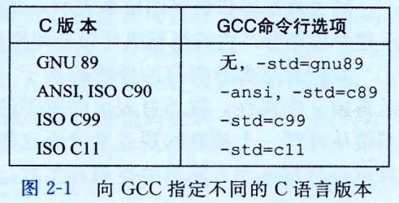
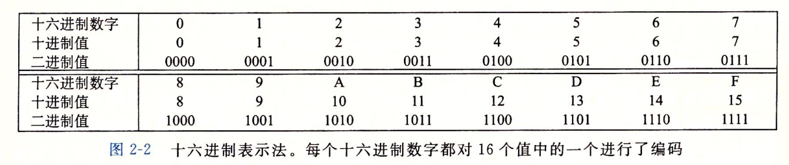
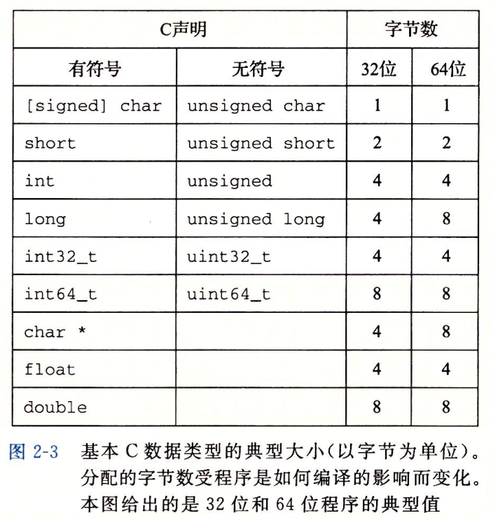

### 2.1 信息存储

#### 2.1.1 十六进制表示法

#### 2.1.2 字数据大小

每台计算机都有一个字长(word size), 指明指针数据的标称大小(nominal size). 因为虚拟地址是以这样的一个字来编码的, 所以字长决定的最重要的系统参数就是虚拟地址空间的最大大小. 也就是说, 对于一个字长为w位的机器而言, 虚拟地址的范围为0~2^w-1, 程序最多访问2^w个字节.

linux> gcc -m32 prog.c

程序可以在32位或者64位机器上运行.

linux> gcc -m64 prog.c

程序只能在64为机器上运行.

#### 2.1.3 寻址和字节顺序

假设变量x的类型为int, 位于地址0x100处, 它的十六进制值为0x01234567. 地址范围0x100~0×103的字节顺序依赖于机器的类型:

